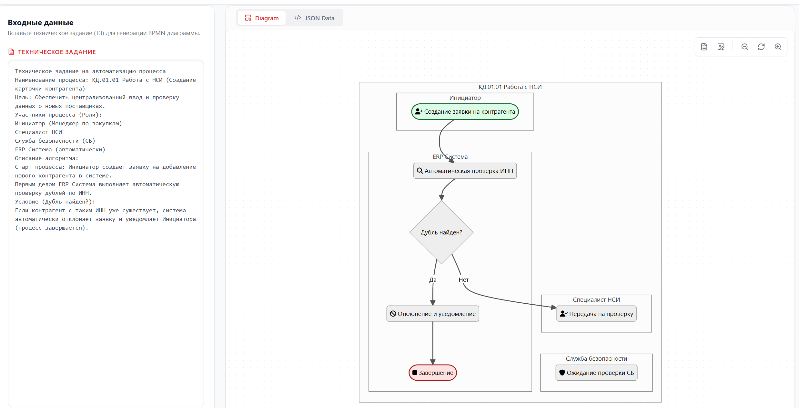
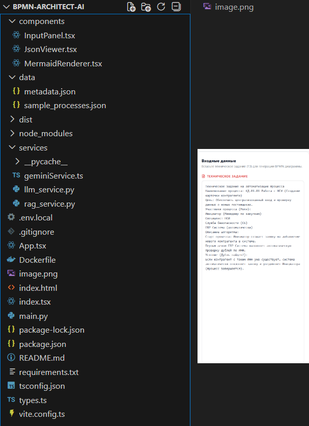

# BPMN Architect AI

AI-инструмент для автоматической генерации BPMN 2.0 диаграмм из текстового описания (ТЗ) с использованием Google Gemini и RAG (Retrieval Augmented Generation).

## 📋 Предварительные требования

Перед началом работы убедитесь, что у вас установлены:

1.  **Docker Desktop** (для запуска контейнера приложения).
2.  **Node.js** (версии 18 или выше) — **Обязательно для сборки фронтенда!**

### ⚠️ Важно: Настройка Node.js в Windows
Если после установки Node.js команды `npm` или `node` не работают в терминале:
1. Нажмите `Win + R`, введите `sysdm.cpl` и нажмите Enter.
2. Перейдите на вкладку **"Дополнительно"** -> кнопка **"Переменные среды"**.
3. В разделе **"Системные переменные"** найдите переменную **Path**.
4. Нажмите "Изменить" и убедитесь, что там есть путь к Node.js (обычно `C:\Program Files\nodejs\`). Если нет — добавьте его.
5. Перезапустите терминал.

---

## 🚀 Установка и первый запуск

Так как в репозиторий GitLab не попадают скомпилированные файлы и секреты, вам нужно выполнить следующие шаги при первом запуске (или после любых изменений в папке `src` или `components`).

### 1. Настройка окружения (.env)
Файлы с переменными окружения **игнорируются** системой контроля версий (они в `.gitignore`).
Вам нужно создать файл `.env` в корневой папке проекта (`bpmn-architect-ai/`) вручную:

**Создайте файл `.env` и добавьте туда:**
```env
GEMINI_API_KEY=ваш_ключ_от_google_gemini
переходите https://aistudio.google.com/ слева снизу get api (нужен vpn при запуске приложения и получения api, это временно, я думаю как реализовать по другому)
```

### 2. Сборка Фронтенда (Обязательно!)
Папка `dist` (готовый фронтенд) находится в `.gitignore` и **не скачивается из GitLab**. Вы должны собрать её локально.

Откройте терминал в папке проекта и выполните:

```bash
# Установка зависимостей (только первый раз)
npm install

# Сборка проекта (создает папку dist)
npm run build
```

> **Важно:** Если вы вносили изменения в `.tsx` или `.ts` файлы, всегда запускайте `npm run build` перед сборкой Docker-образа, иначе изменения не применятся.

### 3. Запуск через Docker

После того как папка `dist` создана, можно запускать приложение в Docker. Бэкенд на Python будет раздавать статические файлы из этой папки.

```bash
# Сборка образа
docker build -t bpmn-app .

# Запуск контейнера
docker run -p 8000:8000 --env-file .env bpmn-app
```

Приложение будет доступно по адресу: `http://localhost:8000`

---

## 🙈 Что игнорируется в Git (и почему этого нет в репозитории)

Следующие файлы и папки прописаны в `.gitignore` и не попадут в GitLab. Их нужно генерировать или создавать локально:

1.  **`/node_modules`** — библиотеки Node.js. Создаются командой `npm install`.
2.  **`/dist`** — скомпилированная версия фронтенда. Создается командой `npm run build`.
3.  **`.env` / `.env.local`** — ваши секретные ключи (API Key). Создайте их вручную.
4.  **`/chroma_db`** — локальная база знаний RAG. Создается автоматически при первом запуске приложения.
5.  **`__pycache__`** — кэш Python.

---

## 🛠 Разработка

Если вы хотите запустить проект в режиме разработки (без Docker, с горячей перезагрузкой):

1.  **Терминал 1 (Бэкенд):**
    ```bash
    pip install -r requirements.txt
    python main.py
    ```
2.  **Терминал 2 (Фронтенд):**
    ```bash
    npm run dev
    ```

итог
файловая структура такая

>>>>>>> dd04043 (важный README)
